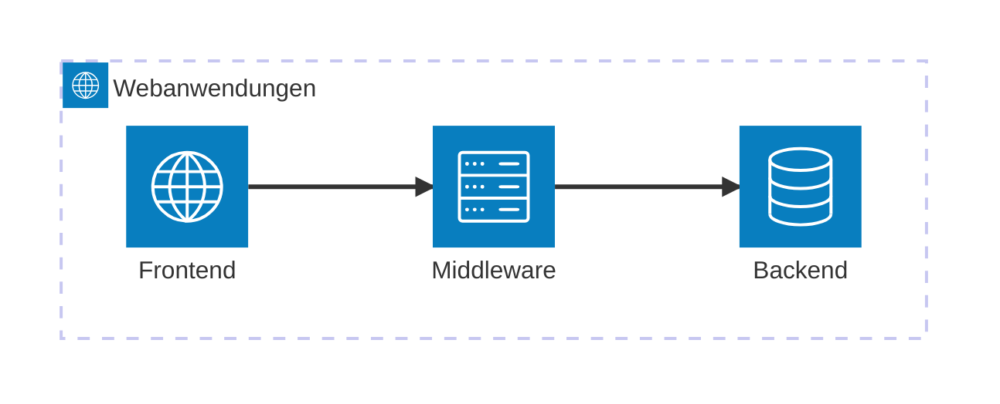

# Maßnahmen zur Gewährleistung der Informationssicherheit bei der Anwendungsprogrammierung

Informationssicherheit I

---

# Agenda

- Motivation
- Secrets und Umgebungsvariablen
- Client- versus Serverlogik
- Datenvalidierung
- Zugänglichkeit von Daten
- Authentifizierung und Autorisierung

---

# Motivation

Datenleck bei VW

<div class="relative">
  <div class="flex flex-row justify-between">
    <div class="flex flex-col">
      <ul>
        <li>
          Daten zu 800.000 Elektrofahrzeugen
          <Arrow v-click x1="320" y1="15" x2="500" y2="50" />
        </li>
        <li>
          präzise Standortdaten zu 460.000 Fahrzeugen
          <Arrow v-after x1="400" y1="48" x2="500" y2="50" />
        </li>
        <li>
          Kontaktinformationen zu den Besitzern
          <Arrow v-after x1="335" y1="80" x2="500" y2="50" />
        </li>
      </ul>
    </div>
    <div class="flex flex-col flex-grow justify-center">
      <div v-after class="text-2xl text-center">
        öffentlich zugänglich
      </div>
    </div>
  </div>
  <span v-click class="absolute top-1/2 left-1/2 transform -translate-x-1/2 -translate-y-1/2 rotate-[-20deg] text-white bg-red-500 text-4xl font-bold text-center rounded-md">
    Verstoß gegen Schutzziel der Vertraulichkeit
  </span>
</div>

<div class="w-full">
  
</div>

---

# Wiederholung

Schutzziele der Informationssicherheit
<v-clicks>

- Vertraulichkeit
  - Zugriff auf Daten nur für autorisierte Personen
- Integrität
  - Veränderung von Daten nur durch autorisierte Personen
- Verfügbarkeit
  - Zugriff auf Daten möglich

</v-clicks>

---
layout: quote
---

# Wie werden die Schutzziele bei der Entwicklung von Anwendungen umgesetzt?

---

# Secrets und Umgebungsvariablen

Dont's

<v-clicks>

- Secrets öffentlich zugänglich machen
  - Begriffswiderspruch: secret ⇔ öffentlich ⚡
- Secrets im (privaten) Git-Repository speichern

</v-clicks>

---

# Secrets und Umgebungsvariablen

Dos

<v-clicks>

- Speicherung kann in Dateien erfolgen
- Formate:
  - .json
  - .env

</v-clicks>

---

# Secrets und Umgebungsvariablen

Dos

<div v-click="1">

```properties
DATABASE_USERNAME=username
DATABASE_PASSWORD=password
DATABASE_HOST=localhost
DATABASE_PORT=5432
DATABASE_NAME=database
```

.env-Datei &#8594; nicht im Repository

</div>

<div v-click="2">

```properties
DATABASE_USERNAME=<database_username>
DATABASE_PASSWORD=<database_password>
DATABASE_HOST=<database_host>
DATABASE_PORT=<database_port>
DATABASE_NAME=<database_name>
```

.env.example-Datei &#8594; im Repository

</div>

---

# Secrets und Umgebungsvariablen

Dos

<div v-click>

```yml
services:
  webapp:
    env_file: ".env"
    environment:
      DATABASE_HOST: ${DATABASE_HOST}
      DATABASE_PORT: ${DATABASE_PORT}
      DATABASE_NAME: ${DATABASE_NAME}
      DATABASE_USERNAME: ${DATABASE_USERNAME}
      DATABASE_PASSWORD: ${DATABASE_PASSWORD}
```

Integration einer .env-Datei in eine `docker-compose.yml`-Datei

</div>

<div v-click>

```yml
spring:
  config:
    import: optional:file:.env[.properties]
  datasource:
    url: jdbc:postgresql://${DATABASE_HOST}:${DATABASE_PORT}/${DATABASE_NAME}
    username: ${DATABASE_USERNAME}
    password: ${DATABASE_PASSWORD}
```

Integration einer .env-Datei in eine `application.yml` von Spring Boot

</div>

---
layout: quote
---

# Wie werden die Zugangsdaten verteilt/ausgetauscht?

---

# Secrets und Umgebungsvariablen

Dos

<div class="w-full flex flex-row">
  <div class="w-1/2">
    <h3>
      lokale Umgebungen
    </h3>
    <ul>
      <li v-click>
        nur zum Testen
      </li>
      <li v-click>
        Zugangsdaten selbst erstellen
      </li>
      <li v-click>
        keine Verteilung
      </li>
    </ul>
  </div>
  <div class="inline-block h-[350px] min-h-[1em] w-0.5 self-stretch bg-neutral-100 dark:bg-white/10 mx-2"></div>
  <div class="w-1/2">
    <h3>
      zentrale Umgebungen
    </h3>
    <ul>
      <li v-click>
        zum Testen oder in der Produktion
      </li>
      <li v-click>
        Möglichkeiten zur Verteilung:
        <ul>
          <li>
            E-Mail
          </li>
          <li>
            Microsoft Teams
          </li>
          <li>
            Secret-Manager
          </li>
        </ul>
      </li>
      <li v-click>
        Mögliche Probleme:
        <ol>
          <li>
            Verschlüsselung beachten
          </li>
          <li>
            Verteilungsplattform dokumentieren
          </li>
          <li>
            keine Unbefugten an Kommunikation beteiligen
          </li>
          <li>
            
          </li>
        </ol>
      </li>
    </ul>
  </div>
</div>

<GoalsOfInformationSecurity :status="{ confidentiality: true, integrity: true, availability: true }" />

---

# Secrets und Umgebungsvariablen

Dos

### Secret-Manager

<v-switch>
  <template #0-4>
    <ul>
      <li v-click="1">
        verschlüsseltes Speichern von Secrets
      </li>
      <li v-click="2">
        Zugriffsbeschränkungssystem
      </li>
      <li v-click="3">
        Beispiele:
        <ul>
          <li>
            AWS Secret Manager
          </li>
          <li>
            Azure Key Vault
          </li>
          <li>
            GCP Secret Manager
          </li>
          <li>
            HashiCorp Vault
          </li>
        </ul>
      </li>
    </ul>
  </template>
  <template #4-11>
    <div class="w-full flex flex-row">
      <div class="w-1/2">
        <h4>
          Vorteile
        </h4>
        <ul>
          <li v-click="5">
            Verschlüsselung
          </li>
          <li v-click="6">
            Vereinheitlichung des Identitäts- und Zugriffsmanagements
          </li>
          <li v-click="7">
            Benutzergruppen für sowohl Repositorys als auch Secrets eines Projektes
          </li>
        </ul>
      </div>
      <div class="inline-block h-[350px] min-h-[1em] w-0.5 self-stretch bg-neutral-100 dark:bg-white/10 mx-2"></div>
      <div class="w-1/2">
        <h4>
          Nachteile
        </h4>
        <ul>
          <li v-click="8">
            Abhängigkeit von Anbietern
          </li>
          <li v-click="9">
            Datenabfluss aus dem Unternehmen heraus
          </li>
          <li v-click="10">
            
          </li>
        </ul>
      </div>
    </div>
  </template>
</v-switch>

---

# Client- versus Serverlogik

3-Schicht-Architektur

<div v-click>



</div>

---

# Client- versus Serverlogik

3-Schicht-Architektur - Aufteilung

<div class="w-full flex flex-row">
  <div class="w-1/2">
    <h3>
      Client
    </h3>
<v-clicks depth="2">

- Frontend (Präsentation)
  - Farbmodus
  - Sprache
  - Höhe und Breite von Grafiken
- Middleware (Zustandsverwaltung)
  - Auswahl von Elementen
  - Datenvalidierung
  - Vorteil: kein Warten auf Antwort des Servers
  - Nachteile: schlechte Performance, Unsicherheit durch Manipulierbarkeit (Beispiel: Cross-Site-Scripting (XSS))

</v-clicks>
  </div>
  <div class="inline-block h-[350px] min-h-[1em] w-0.5 self-stretch bg-neutral-100 dark:bg-white/10 mx-2"></div>
  <div class="w-1/2">
    <h3>
      Server
    </h3>
<v-clicks depth="2">

- Middleware (Geschäftslogik)
  - Datenvalidierung
  - Rechteevaluierung (Authentifizierung und Autorisierung für CRUD-Operationen)
  - Vorteil: Sicherheit
  - Nachteile: Belastung des Servers sowie Reduktion von Performance und Verfügbarkeit (Beispiel: Denial-Of-Service-Angriff (DOS))
- Backend (Datenhaltung)
  - alle Abfragen

</v-clicks>
  </div>
</div>

<GoalsOfInformationSecurity :status="{ confidentiality: true, integrity: true, availability: true }" />

---

# Datenvalidierung

Risiken

<v-clicks depth="2">

- Validierung von Daten vor Verarbeitung
- insbesondere keine Metaprogrammierung mit unvalidierten Daten
  - keine Reflections
  - keine `eval()`-Funktionen
- keine SQL-Abfragen mit unvalidierten Daten (SQL-Injections)
- bei Verwendung unvalidierter Daten:
  - Kompromittierung der Verfügbarkeit und Authentizität des Servers
  - Verletzung der Vertraulichkeit, Integrität und Verfügbarkeit von Daten

</v-clicks>

<GoalsOfInformationSecurity :status="{ confidentiality: true, integrity: true, availability: true }" />

---

# Datenvalidierung

Maßnahmen

<v-clicks>

- zentralisierter Mechanismus
- Transformation in ein einheitliches Schema
- Verwendung von Datentypen der eingesetzten Programmiersprache
  - Gültigkeit von Daten erfassen
- Konformität zur Geschäftslogik (Beispiel: valide E-Mail-Adressen)
- Entfernen von Steueranweisungen aus Eingabefeldern (zur Prävention von XSS)
- Pattern Matching bei Eingaben für SQL-Abfragen (zur Prävention von SQL-Injections)

</v-clicks>

---

# Datenvalidierung

Beispiel

```java {all|2-3|4-8|6|9-14|12}{lines:true}
public class User {
    @NotBlank(message = "Name can not be empty")
    private String name;
    @Pattern(
        message = "Email can not be empty",
        regexp = "^[A-Za-z0-9]+(?:[\\.\\-_]+[A-Za-z0-9]+)*@[A-Za-z0-9-]+(?:\\.[A-Za-z0-9-]+)*\\.[A-Za-z]{2,}$"
    )
    private String email;
    @Pattern(
        message = "Password must be at least 8 characters long and " + 
                  "contain at least one number, one uppercase, one lowercase and one special character", 
        regexp = "^(?=.*[0-9])(?=.*[a-z])(?=.*[A-Z])(?=.*[@#$%^&+=!])(?=\\S+$).{8,}$"
    )
    private String password;
}
```
